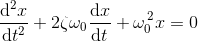
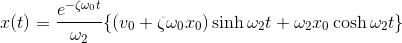

[](https://www.npmjs.com/package/wobble/v/1.5.1)
[](https://circleci.com/gh/skevy/wobble/133)
[](https://codecov.io/gh/skevy/wobble/tree/81d48aa583e633fef9da5d0050002b7438a1eb4d/src)<br />
[](https://github.com/skevy/wobble)
[](https://circleci.com/gh/skevy/wobble/tree/develop)
[](https://codecov.io/gh/skevy/wobble/branch/develop)

A tiny (~1.7 KB gzipped) spring physics micro-library that models a [damped harmonic oscillator](https://en.wikipedia.org/wiki/Harmonic_oscillator#Damped_harmonic_oscillator).

# Why Would I Use This?

Use _wobble_ if you need a very small and accurate damped harmonic spring simulation in your animation library or application. _wobble_ intentionally **only** provides a way to animate a scalar value according to equations governing damped harmonic motion. That's all this library will ever do -- any other functionality (integration with [insert ui library here], multi-dimensional springs, a nice API around chaining springs together, etc.) is left to the reader to implement.

# Background

Using spring physics in UI design is a common way to express natural motion, and there are several ways to model the physics behind springs.

There are two main ways that spring physics is typically implemented: numerical integration (using something like the [Runge-Kutta 4th order](https://en.wikipedia.org/wiki/Runge%E2%80%93Kutta_methods) numerical integration method) or by using a closed-form (exact) solution. Numerical integration is an approximation of the exact solution, and is generally easier to derive. The numerical integration technique can be applied to basically any ordinary differential equation. Though there are several different numerical integration methods, it's common to leverage RK4 when accuracy of the approximation is required, even though it's slightly slower. RK4 is commonly used in other animation libraries, such as [Rebound](https://github.com/facebook/rebound) and [Pop](https://github.com/facebook/pop/).

The original goal of the algorithm used in _wobble_ was to replicate `CASpringAnimation` from Apple's Core Animation library (used to power animations on macOS and iOS) in order to mimic iOS animations in React Native. After doing a [little spelunking](https://github.com/facebook/react-native/pull/15322) inside `QuartzCore.framework`, it became clear that Apple was using the closed-form solution for damped harmonic oscillation to power `CASpringAnimation`. _wobble_ leverages the same equations as `CASpringAnimation` in order to be able to match Apple animations precisely.

The closed-form solution lets us calculate position (_x_) and velocity (_v_) from time _t_, and thus it turns out that using the closed-form solution provides a couple advantages over RK4:

- Easier to generate keyframes and build continuous/interruptible gestures and animations, due to the fact that _x_ and _v_ are pure functions of _t_.
- Less code.
- It's faster.

### Math!

The ODE for damped harmonic motion is:



Solving this ODE yields:



And from this general solution, we're able to easily derive the solutions for under-damped, critically-damped, and over-damped damped harmonic oscillation.

The full proof can be found [in this PDF](http://planetmath.org/sites/default/files/texpdf/39745.pdf) from [planetmath.org](http://planetmath.org).

# Demos

Wobble demos are located here: [https://wobble-demos.now.sh/](https://wobble-demos.now.sh/). Send PRs to add more!

# Getting Started

```bash
yarn add wobble
# or
npm install --save wobble
```

# Usage

```jsx
import { Spring } from 'wobble';

// Create a new spring
const spring = new Spring({
  toValue: 100,
  stiffness: 1000,
  damping: 500,
  mass: 3,
});

// Set listeners for spring events, start the spring.
spring
  .onStart(() => {
    console.log('Spring started!');
  })
  .onUpdate((s) => {
    console.log(`Spring's current value: ` + s.currentValue);
    console.log(`Spring's current velocity: ` + s.currentVelocity);
  })
  .onStop(() => {
    console.log('Spring is at rest!');
  })
  .start();
```

# API

#### `new Spring(config: SpringConfig)`

Initialize a new spring with a given spring configuration.

## Configuration

#### `fromValue: number`

Starting value of the animation. Defaults to `0`.

#### `toValue: number`

Ending value of the animation. Defaults to `1`.

#### `stiffness: number`

The spring stiffness coefficient. Defaults to `100`.

#### `damping: number`

Defines how the spring’s motion should be damped due to the forces of friction. Defaults to `10`.

#### `mass: number`

The mass of the object attached to the end of the spring. Defaults to `1`.

#### `initialVelocity: number`

The initial velocity (in units/ms) of the object attached to the spring. Defaults to `0`.

#### `allowsOverdamping: boolean`

Whether or not the spring allows "overdamping" (a damping ratio > 1). Defaults to `false`.

#### `overshootClamping: boolean`

False when overshooting is allowed, true when it is not. Defaults to `false`.

#### `restVelocityThreshold: number`

When spring's velocity is below `restVelocityThreshold`, it is at rest. Defaults to `.001`.

#### `restDisplacementThreshold: number`

When the spring's displacement (current value) is below `restDisplacementThreshold`, it is at rest. Defaults to `.001`.

## Methods

#### `start(): Spring`

If `fromValue` differs from `toValue`, or `initialVelocity` is non-zero, start the simulation and call the `onStart` listeners.

#### `stop(): Spring`

If a simulation is in progress, stop it and call the `onStop` listeners.

#### `updateConfig(updatedConfig: PartialSpringConfig): Spring`

Updates the spring config with the given values. Values not explicitly supplied will be reused from the existing config.

#### `onStart(listener: SpringListenerFn): Spring`

The provided callback will be invoked when the simulation begins.

#### `onUpdate(listener: SpringListenerFn): Spring`

The provided callback will be invoked on each frame while the simulation is running.

#### `onStop(listener: SpringListenerFn): Spring`

The provided callback will be invoked when the simulation ends.

#### `removeListener(listenerFn: SpringListenerFn): Spring`

Remove a single listener from this spring.

#### `removeAllListeners(): Spring`

Removes all listeners from this spring.

## Properties

#### `currentValue: number`

The spring's current displacement.

#### `currentVelocity: number`

The spring's current velocity in units / ms.

#### `isAtRest: boolean`

If the spring has reached its `toValue`, or if its velocity is below the `restVelocityThreshold`, it is considered at rest. If `stop()` is called during a simulation, both `isAnimating` and `isAtRest` will be false.

#### `isAnimating: boolean`

Whether or not the spring is currently emitting values. Note: this is distinct from whether or not it is at rest. See also `isAtRest`.

# Credits

Brenton Simpson ([@appsforartists](https://twitter.com/appsforartists)) - For his assistance in creating and testing this library.

Devine Lu Linvega ([@neauoire](https://twitter.com/neauoire)) - The awesome logo!
